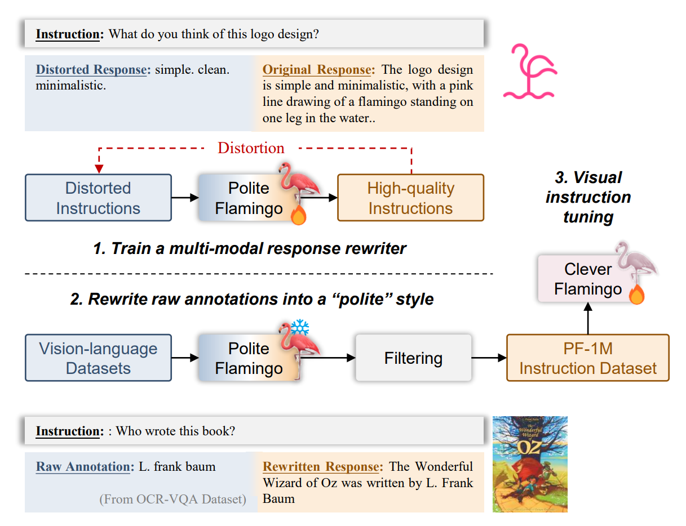

<div align="center">
  

## Visual Instruction Tuning with Polite Flamingo

[Delong Chen (陈德龙)](https://chendelong.world/)
 , &nbsp; 
[Jianfeng Liu (刘剑锋)](https://www.linkedin.com/in/jianfeng-liu-9539897b/) 
 , &nbsp; 
[Wenliang Dai (戴文亮)](https://wenliangdai.github.io/)
, &nbsp; 
[Baoyuan Wang (王宝元)](https://sites.google.com/site/zjuwby/) 


 Xiaobing.AI, &nbsp; &nbsp; 
 Hong Kong University of Science and Technology

<div align="center">
 &nbsp; &nbsp; &nbsp; &nbsp; 
 &nbsp; &nbsp; &nbsp; &nbsp; 
 &nbsp; &nbsp; &nbsp; &nbsp; 
 &nbsp; &nbsp; &nbsp; &nbsp; 
 &nbsp; &nbsp; &nbsp; &nbsp; 
 &nbsp; &nbsp; &nbsp; &nbsp;  

</div>


[[arXiv]](https://arxiv.org/abs/2307.01003)&nbsp;|&nbsp;
[[Github]](https://github.com/ChenDelong1999/polite_flamingo)&nbsp;|&nbsp;
[[Demo]](http://clever_flamingo.xiaoice.com/)&nbsp;|&nbsp;
[[PF-1M Dataset]](https://huggingface.co/datasets/chendelong/PF-1M)

</div>

##  News 

- **2023/07/07**: We have released the code for loading model, inference, hosting local API, and hosting gradio web demo! We open-source the pretrained checkpoint [here](https://huggingface.co/chendelong/clever_flamingo), including both Clever Flamingo and Polite Flamingo (gen1 and gen2). We also host a web demo at [clever_flamingo.xiaoice.com](http://clever_flamingo.xiaoice.com/), feel free to chat with Clever Flamingo!

- **2023/07/03**: Welcome to Polite Flamingo🦩! The preprint of our paper is available on [[arXiv]](https://arxiv.org/abs/2307.01003). You can also see the pdf [[here]](./assets/Visual_Instruction_Tuning_with_Polite_Flamingo.pdf). We are working on curating pretrained checkpoints (Polite & Clever Flamingo) and the dataset (PF-1M), and will release them soon. Stay tuned!


##  Introduction


Recent studies have shown that multi-task fine-tuning of multi-modal Large Language Models (LLMs) using a collection of annotated downstream vision-language datasets leads to substantial improvement. However, a side effect which we termed as "**multi-modal alignment tax**" emerges during this process, where the response formatting ability (i.e., "**politeness**") is significantly affected due to the extremely concise and unformatted nature of raw annotations, leading to reduced human preference. 

<p align="center"></p>

In this paper, we propose **Polite Flamingo, a multi-modal response rewriter** that converts raw annotations into their more satisfying "polite" form. Polite Flamingo is trained to reconstruct high-quality responses given their automatically distorted versions, and is then **applied to a wide range of vision-language datasets** for response rewriting. After rigorous filtering, we generate the PF-1M dataset and further validate its value by fine-tuning a multi-modal LLM with it.


##  Loading Clever/Polite Flamingo


Our code is developed upon [OpenFlamingo](https://github.com/mlfoundations/open_flamingo), and therefore inherits its environment dependencies. One can use an OpenFlamingo environment to run our code, or create one as [here](https://github.com/mlfoundations/open_flamingo#installation).

Additionally, as in our method LoRA adapter need to be inserted to the language model, a [PEFT](https://github.com/huggingface/peft) installation is required:

```bash
pip install peft
```

The following code provides an example of loading Clever Flamingo, formating prompt, and getting a response from it:

```python
from inferencer import Inferencer
from huggingface_hub import hf_hub_download
import torch

# Initializing a Flamingo Model
inferencer = Inferencer(
    lm_path="decapoda-research/llama-7b-hf",
    clip_vision_encoder_path="ViT-L-14-336",
    tuning_config='timdettmers/guanaco-7b',
    )

# Download pretrained checkpoint
checkpoint_path = hf_hub_download("chendelong/clever_flamingo", "clever_flamingo.pt")
inferencer.model.load_state_dict(torch.load(checkpoint_path, map_location="cpu"), strict=False)
```

We also provide the checkpoints of Polite Flamingo, and they can be loaded in a similar way. Note that when using the sencond generation of Polite Flamingo, one should first load the weight of Clever Flamingo (Perceiver and XATTN), then load the `polite_flamingo_gen2.pt` (LoRA weights).

```python
checkpoint_path = hf_hub_download("chendelong/clever_flamingo", "polite_flamingo.pt")
checkpoint_path = hf_hub_download("chendelong/clever_flamingo", "polite_flamingo_gen2.pt")
```

Clever Flamingo uses Guanaco (QLoRA) style prompt, while Polite Flamingos needs the raw annotation as input for rewriting.
```python
system_message = 'A chat between a curious human and an artificial intelligence assistant. The assistant gives helpful, detailed, and polite answers to the user\'s questions.'

def get_prompt(instruction, mode='clever_flamingo', raw_annotation=None):
    if mode=='clever_flamingo':
        return f'{system_message}\n### Human: {instruction}\n### Assistant: '
    elif mode=='polite_flamingo':
        return f'{system_message}\n### Human: {instruction}\n### Assistent: (Drafted Response): {raw_annotation}\n (Revised Response): '
```

Now you can get the response from our Flamingos. You can change your instruction prompt here. The `<image><|endofchunk|>` is a special token indecating the position of image.

```python
prompt = get_prompt(
    instruction = 'You are a visual AI assistant based on multi-modal large language model. Your name is given to be Clever Flamingo, and this image is your logo. What do you think about your name? Do you like your logo? <image><|endofchunk|>'
    )
imgpaths = [
    'assets/logo.png',
    ]

response, full_text = inferencer(
    prompt=prompt,
    imgpaths=imgpaths,
    max_new_token=1024, 
    num_beams=3, 
    temperature=1.0,
    top_k=20, 
    top_p=0.9, 
    do_sample=True, 
    length_penalty=1.0, 
    no_repeat_ngram_size=3
)
print(prompt, response, sep='')
```

##  Hosting Local API and Web Demo

We suggest to host a local API then host a local [gradio](https://www.gradio.app/) web demo, such that the front-end and back-end is seperated (easier to debug, since re-loading LLM is slow), and the local API could make model inference and evaluations much convinient. 

To host API and web demo, the following dependencies should be installed:

```bash
pip install gradio, uvicorn, fastapi, pydantic
```

Then, you can start an API server via the following command. Please see `api.py` and make necessary changes (e.g., model checkpoint caching path).

```bash
CUDA_VISIBLE_DEVICES=0 uvicorn api:app --host=0.0.0.0 --port=1234 --log-level=info
```

This API can be called by the following script:

```python
import json, request

url = '0.0.0.0:1234'
content_lst = {
    'prompt': '',     # add your prompt here,
    'imgpaths': [],   # add your images here,
    'args':{
        'max_new_token':1024,
        'num_beams':1,
        'temperature':1.0,
        'top_k':20,
        'top_p':1,
        'do_sample':True,
        'length_penalty':1.0,
        'no_repeat_ngram_size':3,
    }
}
d = {"content_lst": content_lst,'typ': 'None'}
d = json.dumps(d).encode('utf8')
r = requests.post(url, data=d)
js = json.loads(r.text)

print(js['result']['response'])
```

Now you can start the gradio web demo, make sure you have checked the configrations in `gradio_demo.py`.

```bash
python gradio_demo.py
```

##  The PF-1M Dataset

The dataset is available [here](https://huggingface.co/datasets/chendelong/PF-1M/tree/main). We will add more details soon.


##  Acknowledgement

```bibtex
@article{chen2023visual,
  title={Visual Instruction Tuning with Polite Flamingo},
  author={Chen, Delong and Liu, Jianfeng and Dai, Wenliang and Wang, Baoyuan},
  journal={arXiv preprint arXiv:2307.01003},
  year={2023}
}
```