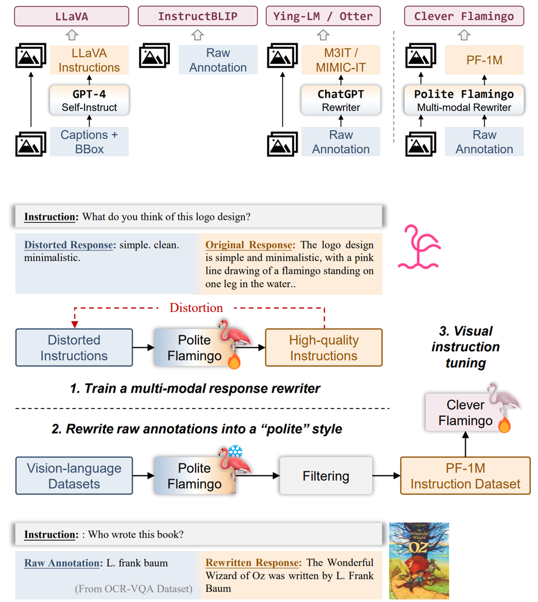

<div align="center">
  
</div>

## Visual Instruction Tuning with Polite Flamingo🦩

[Delong Chen (陈德龙)](https://chendelong.world/)
 , 
[Jianfeng Liu (刘剑锋)](https://www.linkedin.com/in/jianfeng-liu-9539897b/) 
 , 
[Wenliang Dai (戴文亮)](https://wenliangdai.github.io/)
, 
[Baoyuan Wang (王宝元)](https://sites.google.com/site/zjuwby/) 


 Xiaobing.AI
, 
 Hong Kong University of Science and Technology


<div align="center">
 &nbsp; &nbsp; &nbsp; &nbsp; 
 &nbsp; &nbsp; &nbsp; &nbsp; 
 &nbsp; &nbsp; &nbsp; &nbsp; 
 &nbsp; &nbsp; &nbsp; &nbsp; 
 &nbsp; &nbsp; &nbsp; &nbsp; 
 &nbsp; &nbsp; &nbsp; &nbsp;  

</div>


[[arXiv]](https://arxiv.org/abs/2307.01003) | 
[[Github]](https://github.com/ChenDelong1999/polite_flamingo) | 
[[Demo (coming soon)]]() |
[[PF-1M Dataset (coming soon)]]()

> **Abstract:** Recent research has demonstrated that the multi-task fine-tuning of multi-modal Large Language Models (LLMs) using an assortment of annotated downstream vision-language datasets significantly enhances their performance. Yet, during this process, a side effect, which we termed as the "multi-modal alignment tax", surfaces. This side effect negatively impacts the model's ability to format responses appropriately - for instance, its "politeness" - due to the overly succinct and unformatted nature of raw annotations, resulting in reduced human preference. **In this paper, we introduce Polite Flamingo, a multi-modal response rewriter that transforms raw annotations into a more appealing, "polite" format.** Polite Flamingo is trained to reconstruct high-quality responses from their automatically distorted counterparts and is subsequently applied to a vast array of vision-language datasets for response rewriting. After rigorous filtering, we generate the PF-1M dataset and further validate its value by fine-tuning a multi-modal LLM with it. Combined with novel methodologies including U-shaped multi-stage tuning and multi-turn augmentation, the resulting model, Clever Flamingo, demonstrates its advantages in both multi-modal understanding and response politeness according to automated and human evaluations.


## News

- **2023/06/30**: Welcome to Polite Flamingo🦩! The preprint of our paper is available on [[arXiv]](https://arxiv.org/abs/2307.01003). You can also see the pdf [[here]](./assets/Visual_Instruction_Tuning_with_Polite_Flamingo.pdf). We are working on curating pretrained checkpoints (Polite & Clever Flamingo) and the dataset (PF-1M), and will release them soon. Stay tuned!


<p align="center"></p>


## Citation

```bibtex
@article{chen2023visual,
  title={Visual Instruction Tuning with Polite Flamingo},
  author={Chen, Delong and Liu, Jianfeng and Dai, Wenliang and Wang, Baoyuan},
  journal={arXiv preprint arXiv:2307.01003},
  year={2023}
}
```