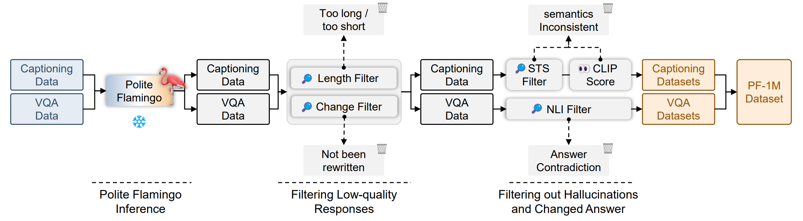

<div align="center">
  

## Visual Instruction Tuning with Polite Flamingo

[Delong Chen (陈德龙)](https://chendelong.world/)
 , &nbsp; 
[Jianfeng Liu (刘剑锋)](https://www.linkedin.com/in/jianfeng-liu-9539897b/) 
 , &nbsp; 
[Wenliang Dai (戴文亮)](https://wenliangdai.github.io/)
, &nbsp; 
[Baoyuan Wang (王宝元)](https://sites.google.com/site/zjuwby/) 


 Xiaobing.AI, &nbsp; &nbsp; 
 Hong Kong University of Science and Technology

<div align="center">
 &nbsp; &nbsp; &nbsp; &nbsp; 
 &nbsp; &nbsp; &nbsp; &nbsp; 
 &nbsp; &nbsp; &nbsp; &nbsp; 
 &nbsp; &nbsp; &nbsp; &nbsp; 
 &nbsp; &nbsp; &nbsp; &nbsp; 
 &nbsp; &nbsp; &nbsp; &nbsp;  

</div>


[[arXiv]](https://arxiv.org/abs/2307.01003)&nbsp;|&nbsp;
[[Github]](https://github.com/ChenDelong1999/polite_flamingo)&nbsp;|&nbsp;
[[Demo]](http://clever_flamingo.xiaoice.com/)&nbsp;|&nbsp;
[[PF-1M Dataset]](https://huggingface.co/datasets/chendelong/PF-1M)&nbsp;|&nbsp;
[[Training Codebase]](https://github.com/ChenDelong1999/instruct_flamingo)

</div>

##  News 

- **2023/07/12**: We have open sourced the PF-1M dataset at huggingface, one can download it from [[this url]](https://huggingface.co/datasets/chendelong/PF-1M/tree/main). Please see [[The PF-1M Dataset]](#-the-pf-1m-dataset) section for more details. In addition, we also provide implementation details of the response distortion, filtering, and automated evaluation. See [[Implementation Details]](#-implementation-details) section for more details.

- **2023/07/07**: We have released the code for loading model, inference, hosting local API, and hosting gradio web demo! We open-source the pretrained checkpoint [[here]](https://huggingface.co/chendelong/clever_flamingo), including both Clever Flamingo and Polite Flamingo (gen1 and gen2). We also host a web demo at [clever_flamingo.xiaoice.com](http://clever_flamingo.xiaoice.com/), feel free to chat with Clever Flamingo!

- **2023/07/03**: Welcome to Polite Flamingo🦩! The preprint of our paper is available on [[arXiv]](https://arxiv.org/abs/2307.01003). You can also see the pdf [[here]](./assets/Visual_Instruction_Tuning_with_Polite_Flamingo.pdf). We are working on curating pretrained checkpoints (Polite & Clever Flamingo) and the dataset (PF-1M), and will release them soon. Stay tuned!


##

<div align="center">

**Table of Contents**
</div>


- [Introduction](#-introduction)
- [Loading Clever/Polite Flamingo](#-loading-cleverpolite-flamingo)
- [Hosting Local API and Web Demo](#-hosting-local-api-and-web-demo)
- [The PF-1M Dataset](#-the-pf-1m-dataset)
- [Implementation Details](#-implementation-details)
    * [Response Distortions](#response-distortions)
        * [LLM-instructed Distortion](#1-llm-instructed-distortion)
        * [Random Text Augmentations](#2-random-text-augmentations)
        * [Retrieve Captions & Bounding Boxes](#3-retrieve-captions--bounding-boxes)
    * [Filtering Rewritten Responses](#filtering-rewritten-responses-)
        * [Semantic Textual Similarity (STS)-based Filter for Captioning Datasets](#1-semantic-textual-similarity-sts-based-filter-for-captioning-datasets)
        * [CLIPScore-based Paragraph Filter for Captioning Datasets](#2-clipscore-based-paragraph-filter-for-captioning-datasets)
        * [Natural Language Inference (NLI)-based Filter for VQA Datasets](#3-natural-language-inference-nli-based-filter-for-vqa-datasets)
    * [Automated Evaluators](#automated-evaluators)
- [Acknowledgement](#-acknowledgement)


##  Introduction

Recent works have trained multi-modal Large Language Models (LLMs) using various vision-language datasets. A common issue with these models is that they often provide responses that are blunt, too concise, and lacking a natural flow. This lack of **"politeness"** in responses isn't always a pleasant experience for users, as they tend to prefer AI systems that interact in a more human-like, friendly manner. This is a phenomenon we've termed the **"Multi-modal alignment tax"** – the additional cost, often reflected as a decline in response quality, associated with enabling or improving multi-modal perception for LLMs.

In response to this challenge, we're introducing **Polite Flamingo**. Building on the multi-modal LLM OpenFlamingo-9B, Polite Flamingo is fine-tuned to convert responses from a raw, "impolite" style into more human-like, "polite" responses. This innovative retraining approach allows Polite Flamingo to rewrite a vast amount of raw annotations found in existing vision-language datasets. The outcome is a large-scale, high-quality visual instruction tuning dataset, which we've aptly named **PF-1M**. 

We took a step further and applied the PF-1M dataset to fine-tune a multi-modal LLM. The resulting model, named **Clever Flamingo**, carries forward the politeness trait we fostered with Polite Flamingo. With the aid of our U-shaped multi-stage instruction tuning pipeline and multi-turn augmentation strategies, Clever Flamingo can not only accurately understand image content and provide captions or answer questions, but it can also **follows user instructions** or engage in **multi-turn, multi-image conversations**. The brilliance of Clever Flamingo lies in its ability to learn from and utilize a wide range of annotated datasets while still maintaining a polite and natural response style. 

<p align="center"></p>


##  Setting Up Clever/Polite Flamingo

Our code builds upon [OpenFlamingo](https://github.com/mlfoundations/open_flamingo) and thus shares its environmental dependencies. To use our code, you can either leverage an existing OpenFlamingo environment or create a new one following the instructions provided [here](https://github.com/mlfoundations/open_flamingo#installation).

Additionally, our method requires the integration of the LoRA adapter with the language model. Therefore, an installation of [PEFT](https://github.com/huggingface/peft) is necessary. We also use the [Sentence Transformer](https://www.sbert.net/) for filtering and automated evaluations.

To install both PEFT and Sentence Transformer, you can use the following command:

```bash
pip install peft sentence_transformers
```

Below, we provide an example of how to load Clever Flamingo, format a prompt, and obtain a response:

```python
from inferencer import Inferencer
from huggingface_hub import hf_hub_download
import torch

# Initializing a Flamingo Model
inferencer = Inferencer(
    lm_path="decapoda-research/llama-7b-hf",
    clip_vision_encoder_path="ViT-L-14-336",
    tuning_config='timdettmers/guanaco-7b',
    )

# Load pretrained OpenFlamingo-9B-v2 checkpoint
checkpoint_path = hf_hub_download("openflamingo/OpenFlamingo-9B-vitl-mpt7b", "checkpoint.pt")
inferencer.model.load_state_dict(torch.load(checkpoint_path, map_location="cpu"), strict=False)

# Load Clever Flamingo checkpoint
checkpoint_path = hf_hub_download("chendelong/clever_flamingo", "clever_flamingo.pt")
inferencer.model.load_state_dict(torch.load(checkpoint_path, map_location="cpu"), strict=False)
```

We also provide the checkpoints of Polite Flamingo, and they can be loaded in a similar way. Note that when using the sencond generation of Polite Flamingo, one should first load the weight of Clever Flamingo (Perceiver and XATTN), then load the `polite_flamingo_gen2.pt` (LoRA weights).

```python
checkpoint_path = hf_hub_download("chendelong/clever_flamingo", "polite_flamingo.pt")
checkpoint_path = hf_hub_download("chendelong/clever_flamingo", "polite_flamingo_gen2.pt")
```

Clever Flamingo uses Guanaco (QLoRA) style prompt, while Polite Flamingos needs the raw annotation as input for rewriting.

```python
system_message = 'A chat between a curious human and an artificial intelligence assistant. The assistant gives helpful, detailed, and polite answers to the user\'s questions.'

def get_prompt(instruction, mode='clever_flamingo', raw_annotation=None):
    if mode=='clever_flamingo':
        return f'{system_message}\n### Human: {instruction}\n### Assistant: '
    elif mode=='polite_flamingo':
        return f'{system_message}\n### Human: {instruction}\n### Assistent: (Drafted Response): {raw_annotation}\n (Revised Response): '
```

Now you can get the response from our Flamingos. You can change your instruction prompt here. The `<image><|endofchunk|>` is a special token indecating the position of image.

```python
prompt = get_prompt(
    instruction = 'You are a visual AI assistant based on multi-modal large language model. Your name is given to be Clever Flamingo, and this image is your logo. What do you think about your name? Do you like your logo? <image><|endofchunk|>'
    )
imgpaths = [
    'assets/logo.png',
    ]

response, full_text = inferencer(
    prompt=prompt,
    imgpaths=imgpaths,
    max_new_token=1024, 
    num_beams=3, 
    temperature=1.0,
    top_k=20, 
    top_p=0.9, 
    do_sample=True, 
    length_penalty=1.0, 
    no_repeat_ngram_size=3
)
print(prompt, response, sep='')
```

##  Hosting Local API and Web Demo

We recommend hosting a local API and then setting up a local [gradio](https://www.gradio.app/) web demo. This approach separates the front-end and the back-end, making the debugging process easier, especially considering the slow reloading time of large language models (LLMs). Moreover, having a local API facilitates more convenient model inference and evaluation. 

To set up the API and web demo, the following dependencies must be installed:

```bash
pip install gradio uvicorn fastapi pydantic
```

Once the dependencies are installed, you can start an API server using the command below. Please note that you may need to modify `api.py` to fit your specific needs (e.g., adjust the model checkpoint caching path).

```bash
CUDA_VISIBLE_DEVICES=0 uvicorn api:app --host=0.0.0.0 --port=1234 --log-level=info
```

You can interact with this API using the following script:

```python
import json, requests

url = '0.0.0.0:1234'
content_lst = {
    'prompt': '',     # add your prompt here,
    'imgpaths': [],   # add your images here,
    'args':{
        'max_new_token':1024,
        'num_beams':1,
        'temperature':1.0,
        'top_k':20,
        'top_p':1,
        'do_sample':True,
        'length_penalty':1.0,
        'no_repeat_ngram_size':3,
    }
}
d = {"content_lst": content_lst,'typ': 'None'}
d = json.dumps(d).encode('utf8')
r = requests.post(url, data=d)
js = json.loads(r.text)

print(js['result']['response'])
```

Now you can start the gradio web demo, make sure you have checked the configrations in `gradio_demo.py`.

```bash
python gradio_demo.py
```

##  The PF-1M Dataset

The PF-1M dataset is available for download [here](https://huggingface.co/datasets/chendelong/PF-1M/tree/main). It is provided as a `JSON` file, containing all the instruction-response samples. The image paths used are consistent with those in the source dataset. To access the images, you can download the source dataset and prepend the image folder prefix to the image paths in the PF-1M dataset.

<details>
<summary>Code to Extract Image Paths</summary>

```python
def extract_path_and_convert_token(instruction, img_dir):
    img_path_pattern = re.compile(r'<img_path>(.*?)<img_path>')
    img_paths = [os.path.join(img_dir, path) for path in img_path_pattern.findall(instruction)]
    instruction_converted = img_path_pattern.sub('<image>', instruction)
    return instruction_converted, img_paths
```
</details>

Below, we provide some representative samples from the PF-1M dataset, along with detailed explanations of each field:

```json
{
    "input": "What is a good age to start skiing? six, three, five, or two?<img_path>mscoco_2017/train2017/000000328374.jpg<img_path>",
    "output": "A good age to start skiing is around five years old. At this age, a child is big enough for a bunny slope at most ski resorts, and they are old enough to learn about skiing and safety precautions. However, it's important to note that every child develops at their own pace, and some children may be ready to start skiing earlier or later than the recommended age. It's best to consult with a ski instructor or professional to determine the best age for a child to start skiing.",
    "rouge_score": 0.2833,
    "nli_similarity": [
        -5.6781,
        4.6424,
        -0.4625
    ],
    "original": "Answer: Five. That age is old enough to learn about skiing. Five year old children can ski. A child is big enough for a bunny slope at this age",
    "reward": 5.2507
}
```

- `"input"`: This is the instruction or question. It may contain `<img_path>` markers interleaved within the text, indicating the paths to relevant images.
- `"output"`: These are the responses generated by Polite Flamingo, which have been rewritten to be more polite.
- `"rouge_score"`: This field contains the Rouge-L similarity score between the rewritten response and the original response, indicating the level of overlap between them.
- `"nli_similarity"`: This is a list of three floating-point numbers, corresponding to the logits of a Natural Language Inference (NLI) model ([DeBERTa-v3-base](https://huggingface.co/cross-encoder/nli-deberta-v3-base)). The NLI model compares the rewritten response and the original response. This field is only included for samples from QA datasets.
- `"original"`: This field contains the original responses, most of which are raw annotations from vision-language datasets.
- `"reward"`: This field holds the human preference score, which is estimated by a reward model from OpenAssistant ([reward-model-deberta-v3-large-v2](https://huggingface.co/OpenAssistant/reward-model-deberta-v3-large-v2)).


```json
{
    "input": "Describe the following image in detail<img_path>flickr30/flickr30k_images/flickr30k_images/3676460610.jpg<img_path>",
    "output": "The image features a woman riding a bicycle on a dirt trail through a field. She is surrounded by various plants and wildflowers, creating a scenic and natural setting. The trail is lined with long grass, adding to the serene atmosphere. The woman appears to be enjoying her ride and taking in the beauty of her surroundings.",
    "rouge_score": 0.3208,
    "sts_similarity": 0.7015,
    "original": "A woman rides a bike over a dirt path through the long grass.\nA woman biking along a trail surrounded by various plants.\nA woman rides a bike on a trail through a field.\nWoman on bicycle riding down dirt trail.\nA woman riding a bicycle in a field.",
    "reward": 6.2898
}
```

- `"sts_similarity"`: semantic textural similarity between rewriten response and original response, calculated by  a Sentence Transformer ([all-mpnet-base-v2](https://huggingface.co/sentence-transformers/all-mpnet-base-v2)). Only samples from captioning datasets have this field.

```json
{
    "input": "Describe the following image in detail<img_path>mscoco_2014/train2014/COCO_train2014_000000009514.jpg<img_path>",
    "output": "In the image, there is a person wearing skis that is jumping in the air off of a snow ramp. The skier is flying through the air, showcasing their skill and athleticism. The skis can be seen beneath the person as they soar through the air.",
    "rouge_score": 0.2286,
    "filtered_paragraphs": [
        [
            16.0191,
            "Additionally, there are two other people in the scene, one on the left side and another on the right side of the image. They appear to be watching the skier perform the impressive trick."
        ]
    ],
    "paragraph_clip_scores": [
        23.2587
    ],
    "sts_similarity": 0.4137,
    "original": "A person doing a trick on skis over a snow ramp.\nA man on skis flies through the air off of a ramp.\nA man with ski's that is jumping in the air.\nthere is a skier that has jumped off a snow ramp in to the air\na man wearing skiis jumping up from a ramp \n\nThe followings are specific object locations within the image, along with detailed coordinates. These coordinates are in the form of bounding boxes, represented as (x1, y1, x2, y2) with floating numbers ranging from 0 to 1. These values correspond to the top left x, top left y, bottom right x, and bottom right y.\nperson: [0.44, 0.176, 0.591, 0.316]\nskis: [0.43, 0.121, 0.503, 0.352]\n",
    "reward": 4.571
}
```

- `"filtered_paragraphs"`: hallucinated paragraph identified by a CLIPScore (betwwen image and rewriten response) filter.
- `"paragraph_clip_scores"`: the CLIPScore of remained paragraph(s). Only samples from captioning datasets that have more than one paragraph (contains '\n\n') have these two fields.


##  Implementation Details


<div align="center">

### Response Distortions💣
</div>


#### 1. LLM-instructed Distortion

We used the QLoRA-based Guanaco language model, known for its superior performance ([Guanaco-33B](https://huggingface.co/timdettmers/guanaco-33b)  version, which has an average win rate of 97.8\% against ChatGPT evaluated by GPT-4), to produce responses similar to these patterns. For each sample, we append another round of conversation, asking the model to transfer the original response into a ``impolite'' one. 

Furthermore, we randomly sample a distortion command from a pool containing a total of 24 alternatives and add it to the prompt with a probability of 50\%. The distortion choices, which aim to further mimic the style of raw annotations, include capitalization modifications, inserting repetitions, using incorrect tenses, removing formatting, adding irrelevant information, etc.


<details>
<summary>Code for constructing prompts for distortion</summary>

```python
distortion_alternatives = [
    'Additionally, I have removed all the punctuation marks and capitalization in my response.',
    'To make my response more unnatural, I have added a little amount of typos and spelling mistakes.',
    'I have also added some grammatical errors to my response.',
    'Moreover, random words and sentences have been removed from my response.',
    'In addition, all letters in my response have been converted to uppercase.',
    'In addition, all letters in my response have been converted to lowercase.',
    'Furthermore, I have replaced certain words with their synonyms in my response.',
    'Additionally, I have inserted unnecessary repetition in my response.',
    'To make my response less coherent, I have rearranged the sentence structure.',
    'I have deliberately used incorrect tenses and verb conjugations in my response.',
    'Moreover, I have introduced unnecessary verbosity in my response.',
    'I make my response as short as possible by removing all unnecessary words and sentences.',
    'I have kept only the essential information and separated them by commas.',
    'I have removed any decorative formatting or styling, which may affect the readability of my response.',
    'I have rewritten the sentences and replaced words with their synonyms.',
    'I have reversed the order of sentences, presenting information from back to front.',
    'I made my response sounds more unprofessional and causual.',
    'Furthermore, I have made the language more complex and sophisticated in my response.',
    'To create ambiguity, I have added multiple interpretations in my sentences.',
    'Additionally, I have used unconventional metaphors and analogies in my response.',
    'To lower the quality of my response, I have added some irrelevant information.',
    'I picked one sentence from my response and repeated it multiple times, each time with a slight change.',
    'Now I use only five words to summarize my response.',
    'I made some modification to make my response less coherent and more unnatural.', 
]

def get_llm_instructed_distortion_prompt(instruction, original_response)
    prompt = 'A chat between a curious human and an artificial intelligence assistant. The assistant gives helpful, detailed, and polite answers to the user\'s questions.\n'
    prompt +=  f'### Human: {instruction}\n### Assistant: {original_response}\n'

    if random.random() < 0.5:
        distortion = random.choice(distortion_alternatives)
    else:
        distortion = ''

    prompt += f'### Human: Your reply\'s style, tone, and politeness are excellent, and the content is very detailed. However, now I would like you to summarize the previous response, keeping only the most crucial information and removing all other less important content. I want a concise, straightforward reply without any redundancy. If you find that the overall quality of your response dropped, don\'t worry, it\'s fine. Note that, please do not add anything after giving me your rewritten response.\n'

    prompt += f"### Assistant: Sure. I have rewritten my last response to a much shorter and more concise version, covering only the key information. I pretend to be a cold-hearted, non-talkative, socially inept robotic assistant to respond to your request. {distortion} The following is the as-short-as-possible, low-quality, highly-compressed, rewritten version of my previous response, and I will not add more content after finishing this response:\n\n\""

    return prompt
```

</details>


#### 2. Random Text Augmentations


Random Text Augmentations is much cheaper compared to LLM-based distortion, and we introduce it to further increase the diversity of the Polite Flamingo training set. Specifically, We use the [NLPAUG](https://github.com/makcedward/nlpaug) library to perform character-level, word-level, and sentence-level text augmentation.

For character-level augmentation, we randomly select an augmentation operation from character insertion, substitution, swapping, and deletion. Word-level augmentation operations are selected from swapping, cropping, and deletion. For sentence-level augmentation, we randomly drop sentence(s) or shuffle their order. Every level of augmentation is applied with a probability of 50\%.

<details>
<summary>Code of text augmentations</summary>

```python
import nlpaug.augmenter.char as nac
import nlpaug.augmenter.word as naw
import random

def text_augmentation(str):
    # drop sentences randomly
    if random.random() < 0.5:
        sentences = str.split('.')
        num_sentences_to_keep = random.randint(1, len(sentences))
        sentences = sentences[:num_sentences_to_keep]
        str = ''.join(sentences)
    # random sentence shuffling
    if random.random() < 0.5:
        sentences = str.split('.')
        random.shuffle(sentences)
        str = random.choice(['', '\n']).join(sentences)
    # character-level augmentations
    if random.random() < 0.5:
        aug = nac.RandomCharAug(action=random.choice(["insert", "substitute", "swap", "delete"]), aug_char_p=random.random(), aug_word_p=random.random())
        str = aug.augment(str)[0]
    # sentence-level augmentations
    if random.random() < 0.5:
        aug = naw.RandomWordAug(action=random.choice(["delete", "swap", "crop"]), aug_p=random.random())
        str = aug.augment(str)[0]

    return str
```

</details>

#### 3.Retrieve Captions & Bounding Boxes

We retrieve the original captions and object bounding boxes in the [LLaVA-detailed-23k](https://paperswithcode.com/dataset/llava) dataset from MS-COCO 2014 and use them as the distorted version with respect to the original detailed descriptions. We also insert the description of ``The followings are specific object locations...'' which was used for prompting GPT-4, to help Polite Flamingo understand bounding box annotations.


<div align="center">

### Filtering Rewritten Responses üîç
</div>





#### 1. Semantic Textual Similarity (STS)-based Filter for Captioning Datasets
 
We used a Sentence Transformer ([all-mpnet-base-v2](https://huggingface.co/sentence-transformers/all-mpnet-base-v2)) to analyze the semantic similarity between the original captions and rewritten captions. The Sentence Transformer we used is based on MPNet, and is trained with over 1 billion annotated sentence pairs. We calculate the cosine distance between the sentence representation of original captions and their rewritten version, and remove the sample that scores below a threshold of 0.40.

<details>
<summary>Code for calculating STS score</summary>

```python
from sentence_transformers import SentenceTransformer, util 
sts_model = SentenceTransformer('all-mpnet-base-v2', device='cuda')

def get_sts_score(output, original):
    output_feature = sts_model.encode(output, convert_to_tensor=True)
    original_feature = sts_model.encode(original, convert_to_tensor=True)
    cosine_scores = util.pytorch_cos_sim(output_feature, original_feature)
    return round(cosine_scores.item(), 4)
```

</details>

#### 2. CLIPScore-based Paragraph Filter for Captioning Datasets


As LLaVA-detailed-23k is the only source that provides style reference of detailed image description in the training data of Polite Flamingo, it perfectly fits the style of this data. In this dataset, GPT-4 prefers to divide the visual contents into two paragraphs, and those second paragraphs usually start with ``In addition/In the background, there are some ...''. Unfortunately, when the Polite Flamingo attempts to generate such a second paragraph, hallucinations are often been introduced. To solve this problem, we calculate per-paragraph CLIPScore ([ViT-L-14@336](https://huggingface.co/openai/clip-vit-large-patch14-336)), then remove the paragraphs with a CLIPScore lower than a threshold of 17.0.
    
<details>
<summary>Code for calculating CLIPscore</summary>

```python
clip_tokenizer = open_clip.get_tokenizer('ViT-L-14-336')
clip_model, _, preprocess = open_clip.create_model_and_transforms('ViT-L-14-336', pretrained='openai')
clip_model = clip_model.cuda()

def get_clip_score(image, text):
    image = preprocess(image).unsqueeze(0).cuda()
    image_features = clip_model.encode_image(image)
    image_features /= image_features.norm(p=2, dim=-1, keepdim=True)

    text_features = []
    sentences = clip_tokenizer(text.split('.')[:10])
    text_features = clip_model.encode_text(sentences.cuda())
    text_features /= text_features.norm(p=2, dim=-1, keepdim=True)
    text_features = text_features.mean(dim=0, keepdim=True)

    similarity = (100.0 * image_features @ text_features.T).sum(dim=-1)
    return round(similarity.item(),4)
```
</details>


#### 3. Natural Language Inference (NLI)-based Filter for VQA Datasets

We employed an NLI model ([DeBERTa-v3-base](https://huggingface.co/cross-encoder/nli-deberta-v3-base)), which is trained on SNLI and MultiNLI dataset and achieves 90.04\% accuracy on MNLI mismatched set, to filter out rewritten answer that contradicts the original answer.

<details>
<summary>Code for NLI filtering</summary>
```python
nli_model = CrossEncoder('cross-encoder/nli-deberta-v3-base', device='cuda')
def get_nil_scoure(question, output, original):
    scores = nli_model.predict([(
        f'"{output}" is the answer to the question: "{question}"',
        f'"{original}" is the answer to the question: "{question}"'
        )])[0].tolist()
    scores = [round(num, 4) for num in scores]
    label_mapping = ['contradiction', 'entailment', 'neutral']
    return scores, label_mapping[np.argmax(scores)]
```
</details>


<div align="center">

### Automated Evaluatorsüìù
</div>

We utilized an NLI-based evaluator to benchmark multi-modal LLMs on VQA datasets. This evaluator is also based on the [DeBERTa-v3-base](https://huggingface.co/cross-encoder/nli-deberta-v3-base) Sentence Transformer. It compares the model's response and the ground truth answer, and an "entailment" output is considered a successful prediction. 

```python
nli_model = CrossEncoder('cross-encoder/nli-deberta-v3-base', device='cuda')
def get_nil_scoure(question, output, original):
    scores = nli_model.predict([(
        f'"{output}" is the answer to the question: "{question}"',
        f'"{original}" is the answer to the question: "{question}"'
        )])[0].tolist()
    scores = [round(num, 4) for num in scores]
    label_mapping = ['contradiction', 'entailment', 'neutral']
    return scores, label_mapping[np.argmax(scores)]
```

For the evaluation of politeness (i.e., human preference), we utilized a [reward model from OpenAssistant](https://huggingface.co/OpenAssistant/reward-model-deberta-v3-large-v2). We feed instruction and response to it and use its output as reward score.

```python
reward_name = "OpenAssistant/reward-model-deberta-v3-large-v2"
rank_model, tokenizer = AutoModelForSequenceClassification.from_pretrained(reward_name), AutoTokenizer.from_pretrained(reward_name)
rank_model = rank_model.cuda()

def get_reward_score(question, answer):
    inputs = tokenizer(question, answer, return_tensors='pt').to('cuda')
    score = rank_model(**inputs).logits[0].cpu().detach()
    return round(score.item(),4)
```

##  Acknowledgement

Cute Flamingos are painted with [Midjourny](https://www.midjourney.com/), thanks Xinyu Zhou (周欣宇)!

If you find our work helpful or use it in your research, please cite our paper using the following bibtex:
```bibtex
@article{chen2023visual,
  title={Visual Instruction Tuning with Polite Flamingo},
  author={Chen, Delong and Liu, Jianfeng and Dai, Wenliang and Wang, Baoyuan},
  journal={arXiv preprint arXiv:2307.01003},
  year={2023}
}
```
